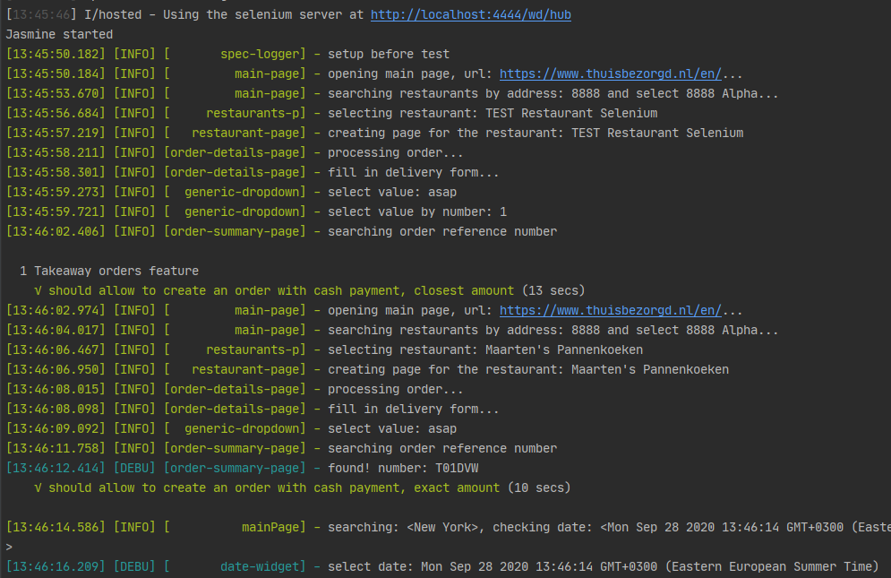
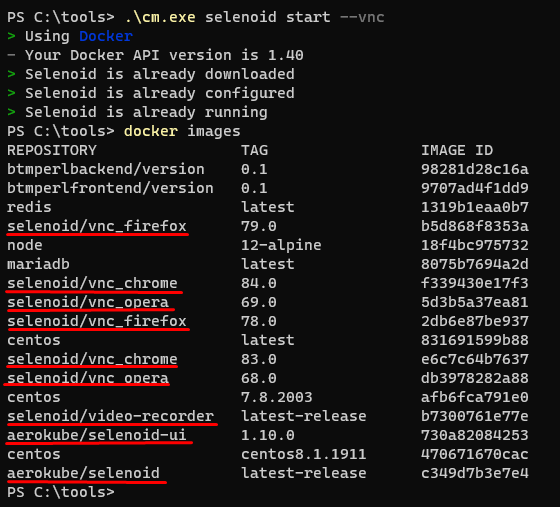
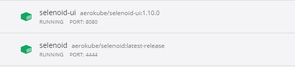
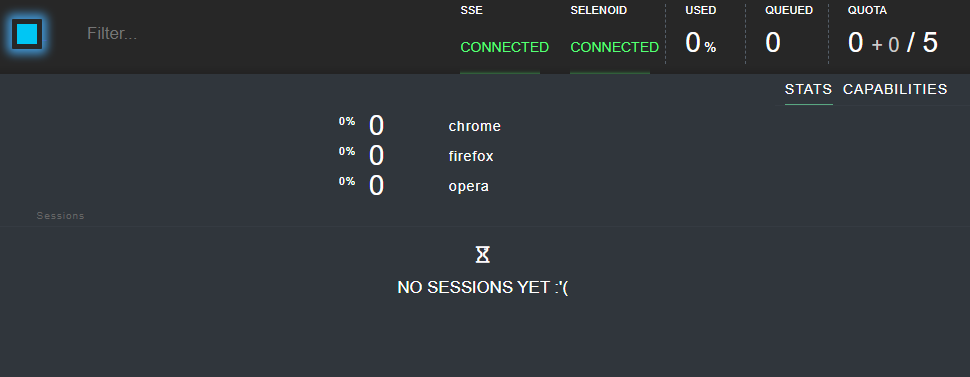
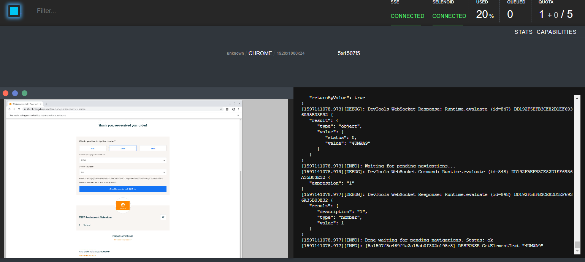
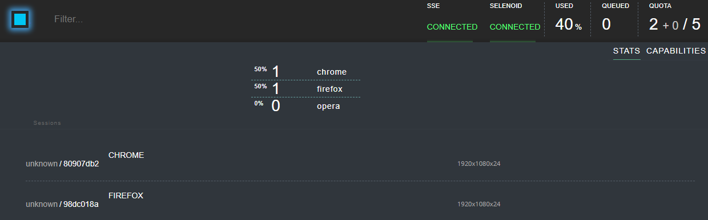
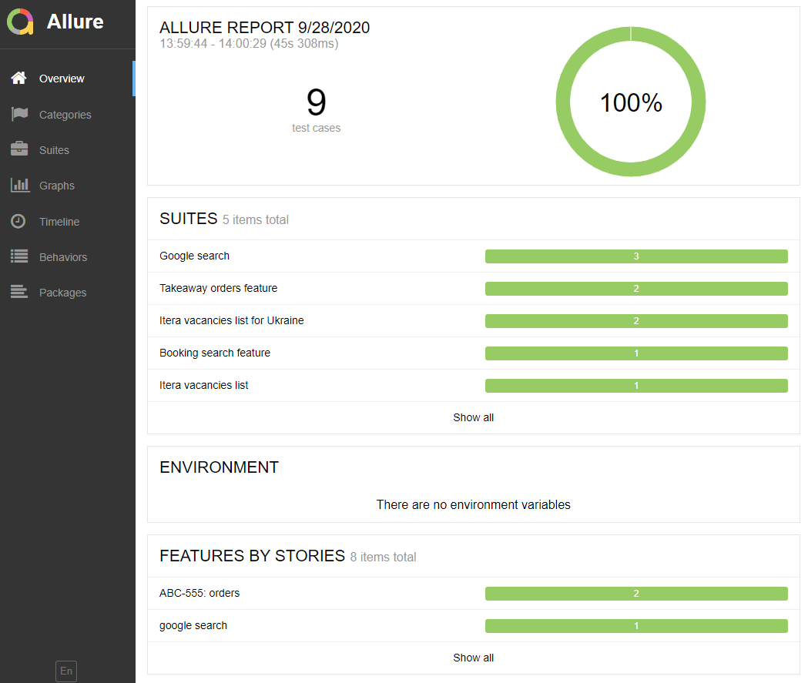
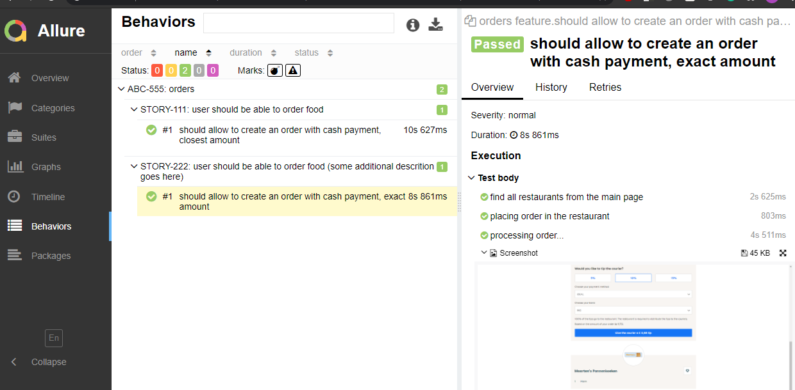

# Examples of using protractor for different non-angular sites
This repository is a collection of simple e2e protractor tests for different non-angular sites.  

**Table of Contents**
1. [Preconditions and environment](#preconditions-and-environment)
2. [How to run](#how-to-run)
3. [Multiple browsers setup](#multiple-browsers-setup)
    1. [How to start selenoid locally](#how-to-start-selenoid-locally)
4. [Test report](#test-report)
5. [Possible issues](#possible-issues) 
6. [TODO](#TODO)

## Preconditions and environment
* Test should work on any linux/unix (CentOS, RedHat, Fedora, etc.) and Windows 10 (start from GitBash)
* node.js version v12.18.1 (or higher)
```bash
node -v
v12.18.1
```
* npm version 6.14.5. (package lock will be ignored with npm v less than 5)
```bash
npm -v
6.14.5
```
* webdriver-manager (installed with protractor), run `webdriver-manager update` to get the latest versions of drivers
```bash
npm ls -g webdriver-manager
/usr/local/lib
└─┬ protractor@7.0.0
  └── webdriver-manager@12.1.7

# status after update
webdriver-manager status
[12:02:16] I/status - selenium standalone version available: 3.141.59 [last]
[12:02:16] I/status - chromedriver version available: 84.0.4147.30 [last]
[12:02:16] I/status - geckodriver version available: v0.27.0 [last]
[12:02:16] I/status - IEDriverServer is not present
[12:02:16] I/status - android-sdk is not present
[12:02:16] I/status - appium is not present
```
* Start selenium server
```bash
webdriver-manager start
```
 
## How to run
* Clone repo
* Install dependencies (`npm i`)
* Run test (`npm t`)
* Open html report (```npm run report```)
```bash
git clone https://github.com/psprogis/itera-ui-tests.git
# ...
cd itera-ui-tests/
npm i
# ...
npm t
# ...
npm run report
# ...
Report successfully generated to allure-report
Starting web server...
# ...
```



## Multiple browsers setup
The easiest way to run test(s) with multiple/different browser(s) at the same time is to change `capabilities` or
`multiCapabilities` in protractor config and use local browsers (do not forget to run `webdriver-manager update` before).
You may not want to connect to the local browser (for example I have the only firefox nightly installed and do not want to
download and install a stable version), the best solution will be to use [Seleniod](https://aerokube.com/selenoid/).
 Steps on how to use selenoid locally are described [below](#how-to-start-selenoid-locally).
 
The previous solution is good just to play around, for some local runs, etc. Here are some possible solutions for the
production testing:
  - deploy a cluster of `Selenoids` in `AWS` or other cloud providers and manage it ourselves.  
  - [Moon](https://aerokube.com/moon/) can be used.
  - for those who have unlimited budget - [BrowserStack](https://www.browserstack.com/) and other alternatives can be used.
 
Here is the list of supported configurations:

`npm t`
```
{
    browserName: 'chrome',
    enableVNC: true,
    version: '',
    platform: 'ANY',
}
```

`npm run test:firefox`

```
{
    browserName: 'firefox',
    enableVNC: true,
    'moz:firefoxOptions': {
        prefs: {
            'geo.enabled': false,
        },
    },
},
```

`npm run test:headless-chrome`

```
{
    browserName: 'chrome',
    chromeOptions: {
        args: ['--headless', '--disable-gpu', '--window-size=1600,1200'],
    },
},
```

`npm run test:multiple`

```
multiCapabilities: [
    {
        browserName: 'chrome',
    },
    {
        browserName: 'firefox',
    },
],
```
### How to start selenoid locally  
- make sure docker is installed and running on your machine.
- download and start `cm` utility, see [official instructions](https://aerokube.com/cm/latest/) or download binary from the
[release page](https://github.com/aerokube/cm/releases). During the first run it will download all necessary browser images.
Run `docker images` to double check:



You can download additional browser versions if needed.
- start `selenoid-ui`:
```bash
.\cm selenoid-ui start
```
2 containers should run now:



- no need to update test configs, by default tests endpoint is `http://localhost:4444/wd/hub`.
  Check status:
  - `http://localhost:4444/status`
  - `docker ps`
  - open UI: `http://localhost:8080/`
  
  

- run your tests
    - chrome run
    
    
    - 2 browsers run
    
    

[more details](https://aerokube.com/selenoid/latest/)

## Test report




## Possible issues
* Selenium standalone is not running - run `webdriver-manager start`
* Russian locale, charset, may affect booking search tests

## TODO
* use [cross-env](https://www.npmjs.com/package/cross-env) module in npm scripts.
* use `NODE_PATH` variable to avoid relative paths in specs
* merge another ui/rest test examples into this repo (swapi, IDR ((http://demo.guru99.com/test/newtours/)), etc.)
* rename repo
* add video recording of a tests and subtitles with the custom ffmpeg-reporter.
* refactor and cleanup navigation menu class
* refactor `customMatchers` 
* (optional) add parameter values into allure steps descriptions.
